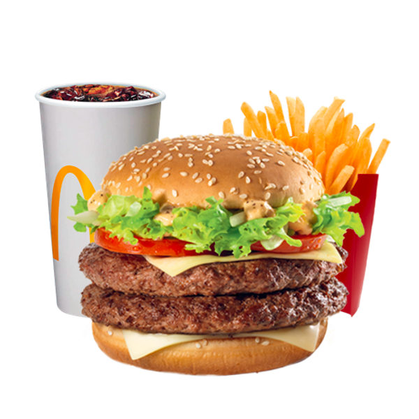
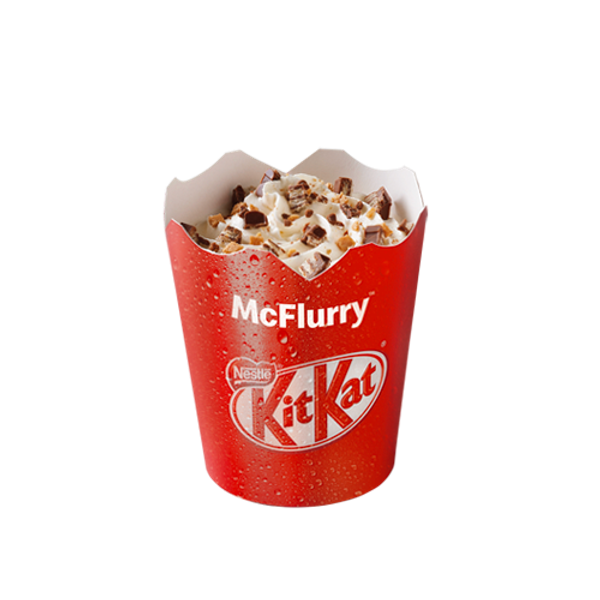
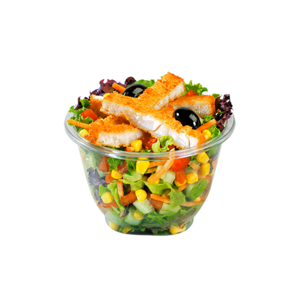
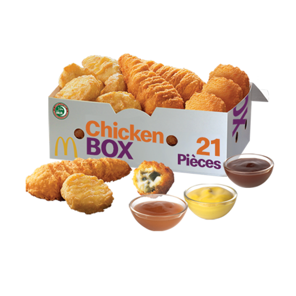

<!DOCTYPE html>
<html lang="en">
  <head>
    <meta charset="UTF-8" />
    <meta name="viewport" content="width=device-width, initial-scale=1.0" />
    <title>Mcdonald's</title>
    <link rel="stylesheet" href="bootstrap.min.css" />
    
    
  </head>
  <body>
    

      <header>
        

          <nav class="col-sm-3" style="text-align: left">
            
          </nav>
          <ul>
            <li><a class="col-sm-2" href="principal.html">homme</a></li>
            <li><a class="col-sm-2" href="#">contact</a></li>
            <li><a class="col-sm-2" href="help.html">help</a></li>
          </ul>
        

      </header>
      

        <h1 class="class">Bienvenue...</h1>
      

      
      <tbody>
        

          <a href="sandwitch.html" id="partie" class="col-sm-5 m-4">
            BURGERES
            
          </a>
          <a href="menus.html" id="partie" class="col-sm-5 m-4">
            MENUS UP
            
          </a>
          <a href="biosson.html" id="partie" class="col-sm-5 m-4">
            BOISONS
            
          </a>
          <a href="glace.html" id="partie" class="col-sm-5 m-4">
            GLACES
            
          </a>
          <a href="salades.html" id="partie" class="col-sm-5 m-4">
            SALADES
            
          </a>
          <a href="snakes.html" id="partie" class="col-sm-5 mt-3">
            snakes
            
          </a>
        

      </tbody>
      

      

      <footer>
        

          
Macdonald1@gmail.com</p1>
          
We have condition in our society....we respect that</p1>
          
thank you for reading</p1>
          
2023 Your Website. All rights reserved. | Inspired by
            McDonald's

        

      </footer>
    

  </body>
</html>
